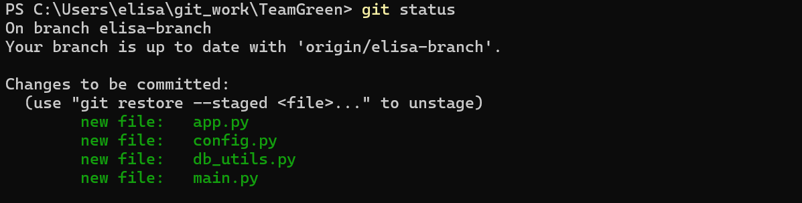
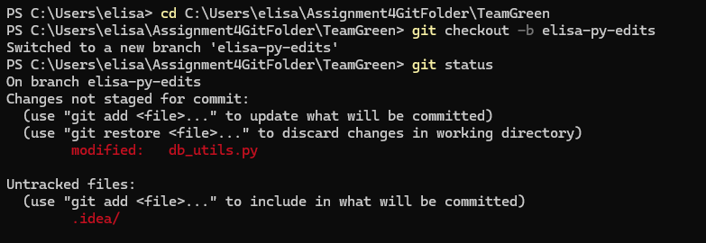
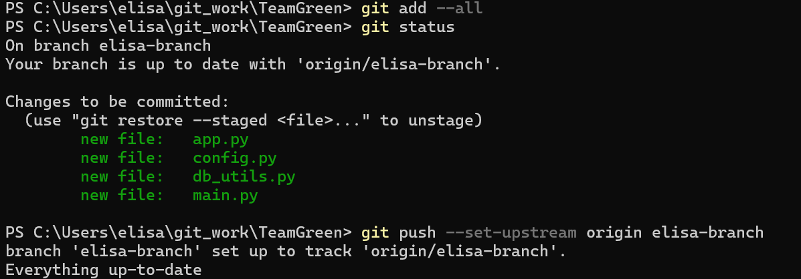
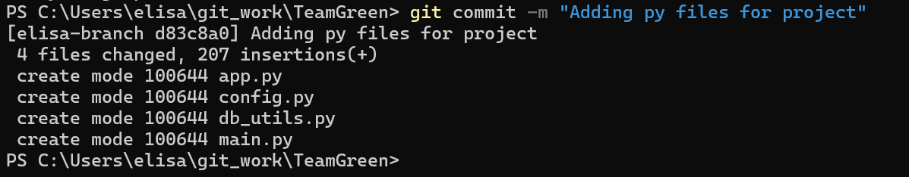
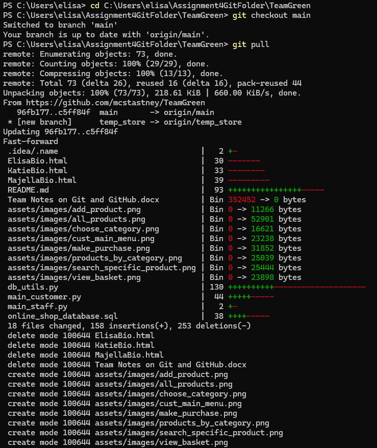
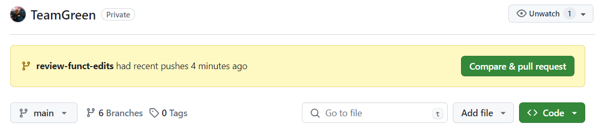
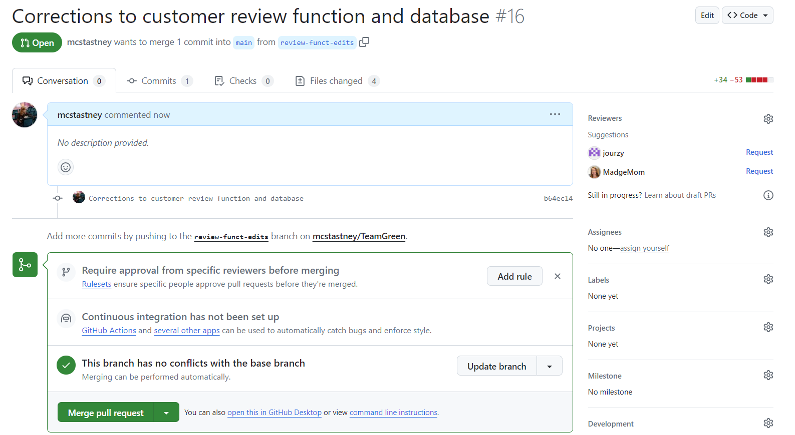
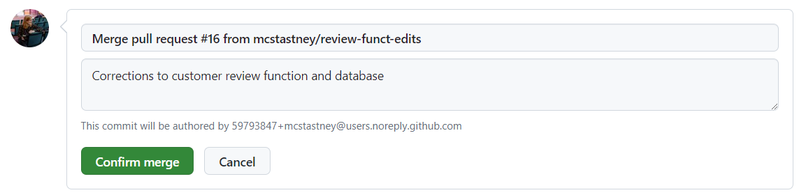

# TeamGreen project
An API for customers and staff to use and manage an online garden centre shop.

## About the project

This API can be used by customers to search and order products from the garden centre’s online shop and add product reviews. 
Garden centre staff can use the API to add and update stock, and to access and add customer information.

The API allows the following transactions:
- Customers can view all products available.
- Customers can search products by category.
- Customers can add reviews to products.
- Staff can add new products to the stocklist.
- Staff can add customers to the database.
- Staff can search for customers by email address.

### Software used
- We used Python to develop the app’s endpoints, connect to a database and design client interfaces for customers and staff.
- We used Flask web framework as our server.
- We used a range of Python libraries: Flask, requests, jsonify, my-sql-connector. 
- We built our database and tables in MySQL. 
- We used Git and Github for version control to collaborate as a team of 4 developers.

### Future updates
For future releases, we will add the following new features:
- Login and authentication.
- Customers can purchase items through the app.
- Customers can delete or modify their account details.
- Customers can search by review rating.
- Customers can search for specific products.
- Customers can book delivery dates and times.
- Staff can delete discontinued products from stocklist.
- Staff can remove customer details for GDPR purposes.
- Staff can view delivery schedule.
- Options for users to undo / edit actions.

## How to install and run the project
1.	Clone the TeamGreen repository to your local machine using the url [https://github.com/mcstastney/TeamGreen.git ](https://github.com/mcstastney/TeamGreen.git)
2.	Open the project files in Pycharm or Visual Studio Code
3.	From your Pycharm or Visual Studio Code terminal, install the project requirements by running: **pip install -r requirements.txt**
4.	Open **config.py** and add your SQL login details.
5.	Run the files in the following order:
    - db_utils.py
    - app.py
    - main_customer.py or main_staff.py
6.	When main_customer.py or main_staff.py is running, navigate through the menu via the console.

### About requirements.txt
requirements.txt is a file that contains a list of packages and libraries that you'll need to work on the project. 
For TeamGreen's project, you can run: **pip install -r requirements.txt** in your Python / VSC terminal to install all of the relevant packages from the requirements.txt file. 

## How to use the project
There are two main.py files: **main_customer.py** and **main_staff.py**.  Users can directly interact with the API by running the functions within the main.py files. 

main_customer.py has been designed to be accessed directly by customers to use for retail shopping purposes. 

main_staff.py has been designed to be accessed directly by staff to use for business administration purposes. 

### Summary of design principles and testing

Both apps were designed for ease of use and to provide the user with a consistent and user friendly interface. Users are able to navigate through the menu options by selecting the appropriate number. Returning back to the main screen and the quitting the program is always 0.
Testing has allowed us to improve the user experience. For example if a user tries to make a purchase with nothing in their basket, they are now informed that their basket is empty instead of seeing a screen with no items on it.

### Functionality of main_staff.py and how to use it

When first running the main_staff.py file the terminal will display a menu of numbered options prompting the user to interact by making a choice and inputting a number

#### Search all customer records
By selecting option 1 the user can view all customer records:

The records displayed are taken directly from the Garden Centre mySQL database ‘online_shop’  (the main python files work in conjunction with the db_utils file and config file to connect to and access the database directly).  

The customer details when retrieved in the terminal are displayed in a table format.  There are functions to determine how information from the database is presented.  

Staff members can easily and clearly view all customer records for any purpose such as marketing, future contact or promotional selling.  

#### Search for customer by email address
Staff can search for an individual customer using their email address by selecting option 2 from the menu:

The entire customer record is displayed once the customer is located.

#### Add customer records to the database
The API interface using the terminal is a quick and easy way for staff to be able to update customer records.  Option 3 on the menu allows the user to add customer records to the database ‘online_shop’.

By selecting option 3 the user will then be asked for several inputs needed to populate the customer record completely. The user inputs match the column headers of the table ‘customers’ within the database ‘online _shop’. The customer_ID column uses auto-increment in the SQL database so the user doesn’t have to input this. 

Once the final input is made, confirmation is made clear to the user through a statement displayed:

To check that the customers details have been added to the database, option 1 can be selected again to view the all customer records to check the addition has been made – this is not necessary but can be reassuring for the staff member to check.

(Added record is highlighted with yellow line)

#### Adding product records to the database
The API interface using the terminal is a quick way for staff to update product records; this is important for managing stock levels. Option 4 allows the user to add product records to the database ‘online_shop’.

By selecting option 4, the user will then be asked for several inputs needed to populate the product record completely.  The user inputs match the column headers of the table ‘products’ within the database ‘online _shop’.  The product_ID column uses auto-increment in the SQL database so the user doesn’t have to input this.

Once the final input is made, confirmation is made clear to the user through a statement displayed:

#### Adding product records to the database
When running main_staff.py, a menu with numbered options prompts users to choose by inputting a number. If they select option 5, they can add a product review.

After selecting option 5, the client can choose to add a review by selecting "yes" or decline by clicking "no." If they proceed, they'll need to input the product ID, rate the product between 1-5, and provide a written review. This information will then be added into the SQL database reviews table.

#### Quit the main_staff program at anytime	
Finally, the menu option zero allows the user to quit the program:

### Functionality of main_customer.py and how to use it

As with staff, when first running the main_customer.py file the terminal will display a menu of numbered options prompting the user to interact by making a choice and inputting a number.

#### View all products

The first option is to view all products. This will display all the products in a user friendly format.
The user can then add a product to their basket by inputting the product code.

Then the user is prompted to input the quantity of the item they want to buy and their shopping basket is updated and displayed. The user can do this as many times as they want until they press 0 to return to the main menu.

#### Find products by category

There is also an option for the user to shop by product category. They select the product category they wish to view and then are taken to a products page showing only the required products.

#### Make purchase

The user can also view their basket. This shows each item ordered and how many they have ordered. In further iterations, the screen will show the total cost for each product and the overal cost to help the user with their purchase.

#### Leave a review

There is also an option for the user to add a review.

#### Under development

In further iterations of the app, users will be able to search for products by entering the name or part of the name.

If they decide not to proceed with their shopping, the user can quit the program. 

## Credits
### TeamGreen members
This team project is a collaboration between four developers:

**[Elisa McGarry](https://github.com/mcstastney)**
My ethos is: 'how can I design this to make life easier for people?' It's what initially inspired me to start learning web development; to improve the platforms I used for employee communications. 
It has sparked such joy in me, I've switched careers from Communications to coding.

Previous CFG degree projects:
- [Houseplant Picker](https://github.com/mcstastney/HouseplantPicker) – HTML, CSS and Javascript app to help users choose the perfect houseplant for each room in their home.
- [Gardener's Forecast API](https://github.com/mcstastney/GardenersForecastAPI) – Python console app to give seasonal gardening tips based on the user's personal goals and real-time local weather forecast.
- [Wildlife Counter](https://github.com/mcstastney/WildlifeCounter) – SQL database designed for a wildlife charity so volunteers can record local wildlife sightings.

In this TeamGreen assignment we’ve used GitHub and Git for version control and collaboration. 

**[Emma Jourzac](https://github.com/jourzy)**
I am a career switcher on a full-stack developer journey.  My background is in education, teaching Computing (however like the majority of Computing teachers in the UK I was not a subject specialist!).
So I did things a bit backwards - I taught a subject, and now I'm learning it! With over ten years encouraging young girls to consider a career in tech, I have made the jump myself.

Previous CFG degree projects:
- [Find your perfect houseplant](https://github.com/jourzy/search-plants) - An app in JavaScript where users can find their perfect houseplant by filtering on criteria such as sunlight and room humidity.
- [Yoga practice generator](https://github.com/jourzy/yoga-practice-generator) - An app in Python where users can search for Yoga poses and add them to a Yoga practice, saved to a text file.
- [Therapy database](https://github.com/jourzy/therapy-database) - A database for a therapist, assisting with diary management and bookings, recording session notes and client data, as well as keeping track of income and expenses.

In this assignment I will be using GitHub for version control, creating branches to work on adding functionality and creating pull requests so that my team can review and merge changes.

**[Katie Kennedy](https://github.com/KatieCodes365)**
I am a Marketing Executive developing my skills to become a software engineer. During my work as a project manager for a charity that helped disabled adults and children, I became interested in software development. 
When I led a project to make technology accessible for everyone, I became aware of the digital divide that exists. Seeing the challenges the people we supported faced and how tech could change their lives made me want to be part of tackling the divide by creating technology for everyone.

Previous CFG projects include:
- Travel Map project in JavaScript which produces a randomly recommended location for the user to travel to.
- Project in Python that uses a weather API to retrieve the latest weather conditions and then curate a music playlist for the user depending on the weather that day.
- Database for a gym, providing membership information and class and treatment data. Members can book a class or a treatment depending on their membership level. The gym can use the database to track income and retrieve members details.

In this assignment I aim to gain a better understanding of the standards and routines followed by professional software developers when using GitHub within a team.
Through hands-on experience and continuous learning, I seek to refine my abilities and contribute effectively to the field of technology.

**[Majella O'Mahony](https://github.com/MadgeMom)**
I am open to work and seeking a first entry role in Software and Web Development. Currently on the Full Stack Pathway of a Nano Degree with Code First Girls.  By day I'm a Specialist Mentor for Adults in Higher Education and by night I learn code! What inspired me to learn computer languages...? I chose to specialise in ICT during my post graduate teacher training and have led the Computer Science Curriculum at KeyStage 2. I discovered that creating coding projects were the highlight of my week and a brilliant way to have a lot of fun whilst also getting creative, problem-solving and being innovative.

Previous CFG Projects:
- Designed and created an interactive web application page for an Educational Academy using HTML, CSS and Javascript
- Created an interactive web application with a suite of interactive productivity tools using HTML, CSS and Javascript
- Create a console app in Python to interact with an API to obtain Data and transform Data for impact
- Designed and built a relational database, with complex queries, in-built functions, joins, stored procedures and to handle specific complex Data requirements
  
This project has given me the oportunity to develop and demonstrate my skills and Knowledge of Python, gain experience with web frameworks such as Flask, gain experience of front and back-end technologies using HTTP methods, familiarity with database systems such as MySQL and gain confidence in using Version Control Systems, such as Git(using terminal commands) and GitHub.  

### References
We are grateful to the following people / organisations for their tuition, resources and guidance. Without them, this project would not be possible.

- [Code First Girls](https://codefirstgirls.com/) and the whole CFG community
- Tech with Tim’s [Create A Python API in 12 Minutes video](https://www.youtube.com/watch?v=zsYIw6RXjfM)
- [PyNative](https://pynative.com/python/basics/) 

## License
[GNU General Public License v3.0](License)

## Evidence of Git and Github skills
(**Note:** Our project was initially called TeamElemella and changed to TeamGreen at a later date, so some screenshots are to different repos.)

### Checking the status of a file

### Creating a branch

### Adding files to a branch

### Adding commits with meaningful messages

### Opening a pull request

#### Pull request in git to local repo

### Merging and deploying to main branch

